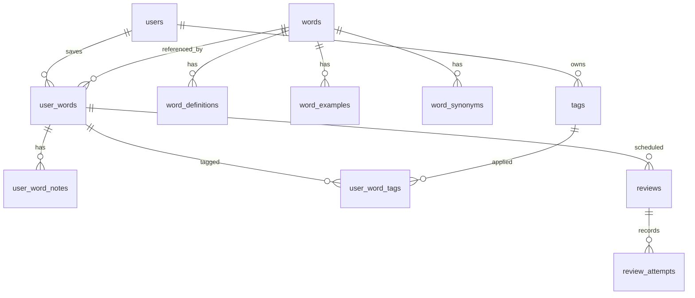

# Initial Data Model

```mermaid
erDiagram
    users ||--o{ user_words : saves
    words ||--o{ word_definitions : has
    words ||--o{ word_examples : has
    words ||--o{ word_synonyms : has
    words ||--o{ user_words : referenced_by
    user_words ||--o{ user_word_notes : has
    users ||--o{ tags : owns
    user_words ||--o{ user_word_tags : tagged
    tags ||--o{ user_word_tags : applied
    user_words ||--o{ reviews : scheduled
    reviews ||--o{ review_attempts : records
```
